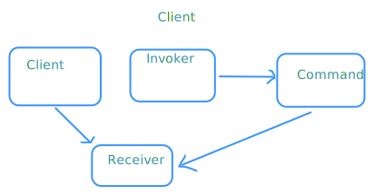

# Command Pattern (명령 패턴)

- 행동 패턴
- 명령을 캡슐화

## 구성

- Command
  - 명령을 나타내는 인터페이스
  - 비즈니스 로직
- Receiver
  - 명령을 수신하는 객체
- Invoker
  - 명령을 실행하는 객체



## 핵심

- 명령이 다양하고 복잡한 비즈니스 로직이 들어가 있을 때 사용하면 좋을 듯
  -> **HandwrittenNote**에서 사용
  

  - 만약 필기 모듈에서 **Command Pattern**을 사용하지 않았다면,
  - 히스토리 관리, 펜, 형광팬, 지우개, 전체 리셋 등 다양한 기능을 하나의 클래스에 다 때려넣어야 했을 것
  - 비즈니스 로직이 복잡해지고, 유지보수가 어려워질 것

  ```ts
  if (type === "pen") {
  } else if (type === "highlighter") {
  } else if (type === "eraser") {
  } else if (type === "reset") {
  }
  ```

## 적용

- example.ts 참고
  
