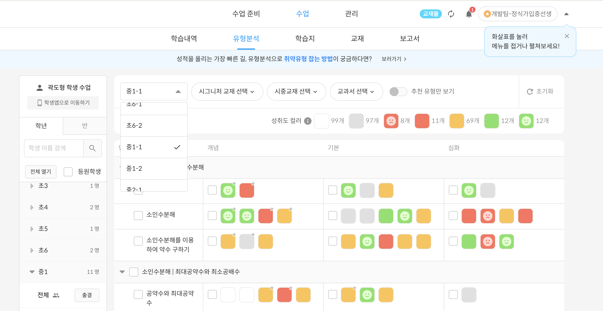

# 퍼사드 패턴

> 퍼사드 패턴은 라이브러리에 대한, 프레임워크에 대한 또는 다른 클래스들의 복잡한 집합에 대한 단순화된 인터페이스를 제공하는 구조적 디자인 패턴입니다.

## 키워드

- 초기화, 종속성 관계 추적, 올바른 순서
- 간단한 인터페이스 제공
- 단순화

## 관계

1. 퍼사드
2. 추가적인 퍼사드
3. 복잡한 하위 시스템
4. 클라이언트

## 용도

- 복잡한 하위 시스템에 대한 제한적이지만 간단한 인터페이스를 제공하고 싶을 때
- 복잡한 하위 시스템에 대한 진입점을 제공하고 싶을 때 -> 퍼사드 클래스를 통해서만 통신한다

- 클라이언트가 복잡한 하위 시스템을 모두 알 필요 없이, 퍼사드 클래스를 통해 간단하게 사용할 수 있다.
  - 의존성 감소
  - 변경 사항 발생 시 클라이언트의 수정을 최소화

### 프로덕트 코드에서

- 유형분석 필터 서비스는 학생별로 학년/학기 별 유형분석 교재 필터 정보를 연동시키는 서비스입니다.



```tsx
class 유형분석서비스 {
  async loadFromRemoteStorage(studentId: Student["id"]) {
    // 1. 리모트 스토리지로부터 이전 필터 정보를 불러온다.
    // 2. 이전 필터 정보의 버전을 확인하고 최신 버전으로 마이그레이션한다.
    // 3. 최신 필터 정보를 불러온다.
    // 4. 최신 필터 정보를 ui에 적용한다.
  }
}

const PageComponent = () => {
  const { studentId } = useParams<{ studentId: string }>();
  const { loadFromRemoteStorage } = useRepo([유형분석서비스, studentId]);

  useEffect(() => {
    // 클라이언트가 원하는 것은 이전 필터 정보를 불러오는 것 뿐이다.
    // 간단한 인터페이스 제공
    loadFromRemoteStorage(studentId);
  }, [studentId]);
};
```
